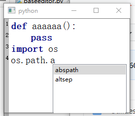

# qtpyeditor

## Description
### What is qtpyeditor
qtpyeditor is an simple editor in pure Python-Qt binding for both PyQt5 and PySide2.

The in order to solve the problem that PySide2 lacks QScintilla bindings. 

**NOTE**: This repository is just **an EDITOR, not an Full-functional IDE** ! 

### Developers and License

This package is developed by PyMiner develop team to support the software of PyMiner,
and the license should follow the qt-bindings' license.

if PyQt5, license should be **GPL**; or if PySide2, it should under **LGPL** License.

email:1295752786@qq.com
### Functions

- Line numbering

- Code Highlighting and Style-Setting

- Autocomplete with background QThread

- Add Hints to code
    - For example, the editor could change background color to red if an undefined variable is found.

### Functions not supported yet -- The items below are also TODOs
 
- Find and Replace
  
- Add Markers (especially the red dot for debugging)

- Fold Code

- Highlight Hyperlinks


## Software Architecture
Coding on pure Python, calling the Qt-bindings.


## Installation

1.  install dependencies
```shell
pip install -r requirements.txt
```
NOTE: qtpy is an upper interface on PyQt5/PySide2, which works only if either of
PyQt5/PySide2 is installed. So please make sure you have one qt-python binding installed
in the site-packages.


## Run Editor
1. run command:
```shell
python test.py
```
2. And you will see an simple editor shown.   


